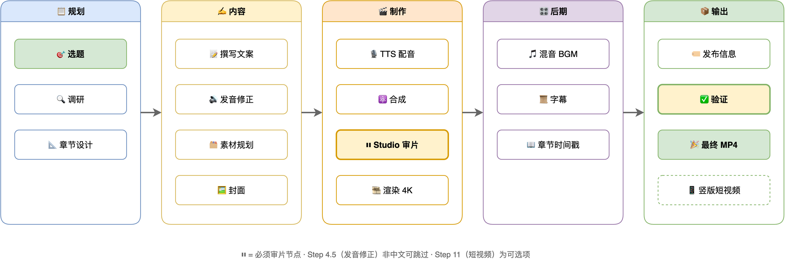
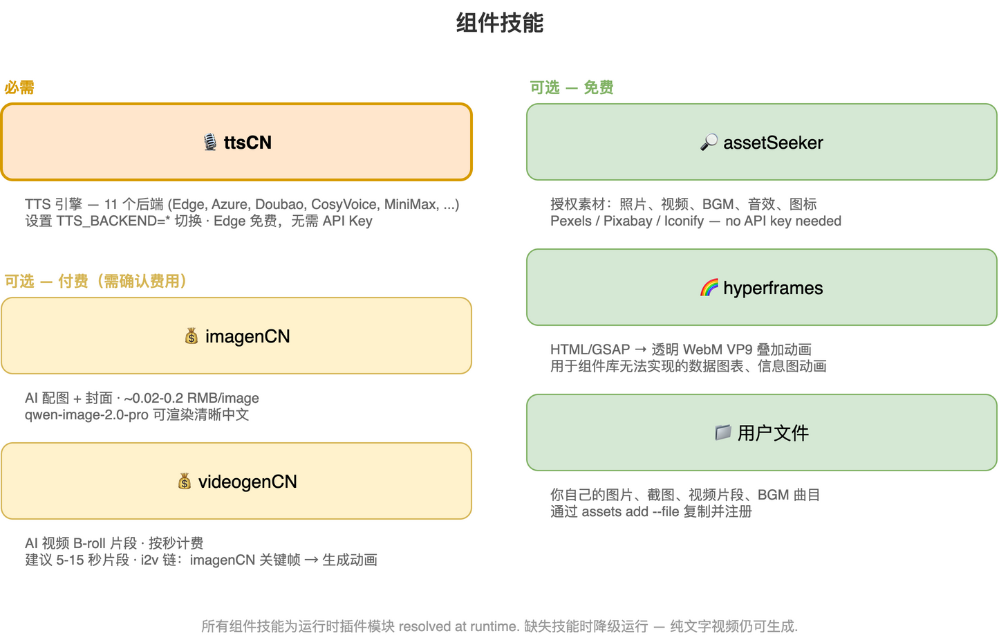
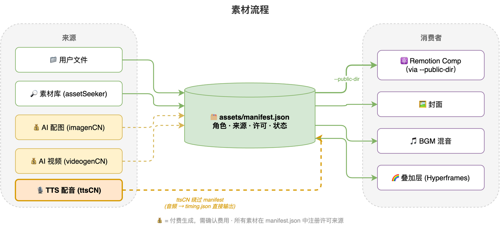

# 视频播客生成器

[](LICENSE)
[](https://github.com/Agents365-ai/video-podcast-maker/stargazers)
[](https://github.com/Agents365-ai/video-podcast-maker/network/members)
[](https://github.com/Agents365-ai/video-podcast-maker/releases/latest)
[](https://github.com/Agents365-ai/video-podcast-maker/commits/main)

[](https://skillsmp.com)
[](https://github.com/Agents365-ai/365-skills)
[](https://agentskills.io)

[English](README.md)

自动化流程，从主题生成专业视频播客。**支持 B站 (Bilibili)、YouTube、小红书、抖音和微信视频号**，多语言输出（zh-CN、en-US）。集成研究、脚本撰写、多引擎 TTS（11 个后端，经 [ttscn](https://github.com/Agents365-ai/ttsCN) 桥接合成）、Remotion 渲染和 FFmpeg 混音。当前版本：**v5.2** —— 版本历史见 [CHANGELOG.md](CHANGELOG.md)。

**支持工具：** [Claude Code](https://claude.ai/code) · [OpenClaw](https://openclaw.ai/) · [OpenCode](https://opencode.ai/) · [Codex](https://openai.com/index/introducing-codex/) · [Pi](https://github.com/earendil-works/pi-coding-agent) — 任何支持 SKILL.md 的 coding agent

**发布平台：** B站 · YouTube · 小红书 · 抖音 · 微信视频号

> **无需编程！** 用自然语言描述你的主题，coding agent 会一步步引导你完成。你做创意决策，agent 处理所有技术细节。

> **提示：** 本项目仍在持续迭代完善中，部分功能可能还不太成熟。欢迎提出宝贵意见和建议 — 可以 [提交 Issue](https://github.com/Agents365-ai/video-podcast-maker/issues) 或直接联系作者！

## 功能特点

- **主题 → 4K 成片** - 研究、旁白脚本、TTS 音频、Remotion 合成、4K 渲染 + BGM 一条龙
- **11 个 TTS 后端** - Edge（免费）、Azure、CosyVoice、豆包、腾讯云、百度、MiniMax、讯飞、ElevenLabs、OpenAI、Google —— 全部由必装的 [ttscn](https://github.com/Agents365-ai/ttsCN) 组件技能合成
- **资产引擎** - 每视频 manifest 记录角色/来源/许可；生产者包括用户文件、assetseeker 图库、imagencn AI 图片、videogencn AI 视频、Hyperframes 透明叠层——付费生成必先确认
- **4K 输出 + Remotion 原生字幕** - 3840×2160；SRT 在 Remotion 内以 React 4K 渲染（传统 FFmpeg 烧录仍可用）
- **设计学习** - 从参考视频/图片提取风格档案；主题匹配时自动套用
- **竖屏短片** - 从长视频章节生成 9:16 精华片段
- **多平台 & 多语言** - B站 / YouTube / 小红书 / 抖音 / 微信视频号 × zh-CN / en-US，按平台生成发布信息
- **发音控制** - 全局 + 项目级多音字词典

## 快速开始

**1. 安装** — 通过 [365-skills marketplace](https://github.com/Agents365-ai/365-skills) 安装（推荐）或克隆本仓库。

**2. 环境准备** — Python 3.8+、Node.js 18+、FFmpeg，以及一个 Remotion 项目：

```bash
brew install ffmpeg node python3          # macOS（Ubuntu: sudo apt install ffmpeg nodejs python3）
pip install -r skills/video-podcast-maker/requirements.txt
npx create-video@latest my-video-project   # 或复用已有的 Remotion 项目
cd my-video-project && npm i
```

**3. 配置** — 设置 `TTS_BACKEND` 及其 API 密钥（见 [TTS 后端](#tts-后端全部经-ttscn-合成) 和 [环境变量](#环境变量)）。

**4. 告诉你的 agent：**

> "帮我制作一个关于 [你的主题] 的视频播客"

agent 会自动跑完整个流程（研究 → 脚本 → TTS → Remotion 合成 → Studio 预览 → 4K 渲染 + BGM）。渲染前可在 Remotion Studio（`npx remotion studio src/remotion/index.ts`）预览迭代；agent 会等你说出明确的"渲染 4K"才进行最终渲染。

## ⚠️ 给读到这里的你（不是给 AI 看的）：`podcast.txt` 必须人工反复打磨

> **这一节是写给你这个真人的，不是写给 agent 的。** 整条流水线后面所有环节 — TTS 朗读、字幕、章节切换、动画节奏、最终成片 — **全部由这一份 `podcast.txt` 决定**。脚本不行，4K 渲出来的也是垃圾。
>
> AI 生成的初稿只是起点。请你亲自做下面这些事，**不要交给 AI 代劳**：
>
> 1. **按口播节奏在脑子里默读。** 每句话当成一口气说完 — 哪句让你"换气换不过来"、哪句要回头重读才懂，立刻改。读得舒服 ≠ 听得舒服，TTS 卡住的地方往往就是你默读时也卡的地方。
> 2. **至少改三遍。**
>    - 第一遍：抓错别字、明显语病、绕口处
>    - 第二遍：砍废话、砍套话、砍"那么我们今天就来聊一聊"这种开场
>    - 第三遍：调节奏 — 哪里断句、哪里加停顿、长句切短、重音落在哪个词上
> 3. **逐章节通读。** 每个 `[SECTION:xxx]` 块从头看到尾，确认开头有钩子、结尾能自然过渡到下一节，不是一堆并列要点堆在一起。
> 4. **数字 / 专有名词 / 英文术语单独审一遍。** TTS 念错的 90% 都集中在这里。读音不对的，去 `phonemes.json` 加词条；读着别扭的，直接换说法。
> 5. **心里要有时长账。** 中文按 **每分钟约 280 字** 估算（英文约每分钟 150 词）。目标 5-10 分钟 ≈ 1400-2800 字，不要凑。
>
> **校验通过的唯一标准：脑子里走完一遍，没有任何一句让你皱眉。** 达不到就不要进 Step 7（TTS），否则你只是在用 4K 渲染一段连你自己都不想听完的内容。

## 工作流程







## 相关技能

- **[remotion-best-practices](https://github.com/remotion-dev/skills)** - 必需；Remotion 核心模式与规范
- **[ttscn](https://github.com/Agents365-ai/ttsCN)** - 必需；全部 11 个 TTS 后端的合成引擎（安装到 `~/.claude/skills/ttscn`、作为 Pi 技能安装，或设置 `TTSCN_HOME`）
- **[assetseeker](https://github.com/Agents365-ai/assetSeeker)** - 可选；许可核验的图库/视频/BGM/音效/图标/字体
- **[imagencn](https://github.com/Agents365-ai/imagenCN)** - 可选；AI 图片与封面（付费 API）
- **[videogencn](https://github.com/Agents365-ai/videogenCN)** - 可选；AI 视频片段，用于 B-roll（付费 API）
- **[Hyperframes](https://github.com/heygen-com/hyperframes)** - 可选；透明动画叠层（Node 22+）

## 环境要求

| 软件 | 版本 | 用途 |
| ------ | ------ | ------ |
| **macOS / Linux** | - | 已在 macOS 测试，兼容 Linux |
| **Python** | 3.8+ | TTS 脚本、自动化 |
| **Node.js** | 18+ | Remotion 视频渲染 |
| **FFmpeg** | 4.0+ | 音视频处理 |

> **推荐通过 marketplace 安装：** 一般用户应通过 [365-skills marketplace](https://github.com/Agents365-ai/365-skills) 安装本技能，而非克隆本仓库。届时 SKILL.md / scripts / templates 位于 agent 暴露的 `${SKILL_DIR}` 路径下；README 中的路径写法是面向贡献者（仓库根目录视角）。

### TTS 后端（全部经 ttscn 合成）

全部 11 个平台均由**必装**的 [ttscn](https://github.com/Agents365-ai/ttsCN) 组件技能负责合成。`TTS_BACKEND` 直接填平台 id，只需配置当前平台的环境变量：

| `TTS_BACKEND` | 平台 | 所需环境变量 | 获取密钥 |
| --------------- | ------ | ------------- | --------- |
| `edge`（默认） | 微软 Edge TTS | *（无 —— 免费）* | — |
| `azure` | 微软 Azure Speech | `AZURE_SPEECH_KEY`（可选 `AZURE_SPEECH_REGION`，默认 `eastasia`） | [Azure 门户](https://portal.azure.com/) |
| `cosyvoice` | 阿里云 CosyVoice | `DASHSCOPE_API_KEY` | [百炼控制台](https://bailian.console.aliyun.com/) |
| `doubao` | 火山引擎豆包 | `VOLCENGINE_APPID`、`VOLCENGINE_ACCESS_TOKEN` | [火山引擎控制台](https://console.volcengine.com/speech/service/8) |
| `tencent` | 腾讯云 TTS | `TENCENT_SECRET_ID`、`TENCENT_SECRET_KEY` | [腾讯云控制台](https://console.cloud.tencent.com/tts) |
| `baidu` | 百度 AI TTS | `BAIDU_APP_ID`、`BAIDU_API_KEY`、`BAIDU_SECRET_KEY` | [百度控制台](https://console.bce.baidu.com/ai/#/ai/speech/overview) |
| `minimax` | MiniMax TTS | `MINIMAX_API_KEY` | [MiniMax 平台](https://platform.minimaxi.com/) |
| `xunfei` | 科大讯飞 TTS | `XUNFEI_APP_ID`、`XUNFEI_API_KEY`、`XUNFEI_API_SECRET` | [讯飞开放平台](https://www.xfyun.cn/) |
| `elevenlabs` | ElevenLabs | `ELEVENLABS_API_KEY` | [ElevenLabs](https://elevenlabs.io/) |
| `openai` | OpenAI TTS | `OPENAI_API_KEY` | [OpenAI Platform](https://platform.openai.com/) |
| `google` | Google Cloud TTS | `GOOGLE_TTS_API_KEY` | [Google Cloud 控制台](https://console.cloud.google.com/) |

**非 TTS 密钥（可选）：** `GEMINI_API_KEY` / `DASHSCOPE_API_KEY` 用于 AI 封面生成（imagencn）。

### 环境变量

添加到 `~/.zshrc` 或 `~/.bashrc`：

```bash
export TTS_BACKEND="edge"                  # azure / cosyvoice / doubao / tencent / baidu / minimax / xunfei / elevenlabs / openai / google
export TTS_VOICE="zh-CN-XiaoxiaoNeural"    # 可选；不设置则用平台默认音色
export TTS_RATE="+5%"                      # 可选；也可写入 user_prefs.json（global.tts.rate）
export TTS_STYLE="gentle"                  # 可选；仅 azure 生效
export AZURE_SPEECH_KEY="..."              # 仅需当前平台的密钥（见上表）
export GEMINI_API_KEY="..."                # 可选：AI 封面
export DASHSCOPE_API_KEY="..."             # 可选：AI 封面（同时也是 cosyvoice 的 TTS 密钥）
```

然后重新加载：`source ~/.zshrc`

## 配置文件

可变用户级文件位于 `~/.video-podcast-maker/`（所有项目共享，技能更新不会覆盖）；其余文件位于技能根目录（本仓库为 `skills/video-podcast-maker/`，marketplace 安装后为 `${SKILL_DIR}`）：

| 文件 | 位置 | 说明 |
| ------ | -------- | ------ |
| `phonemes.json` | `~/.video-podcast-maker/` | 全局多音字词典；首次运行自动从内置模板复制；项目级覆盖放 `videos/{名称}/phonemes.json` |
| `user_prefs.json` | `~/.video-podcast-maker/` | 你的偏好（TTS、BGM、平台、视觉覆盖、风格档案）；首次运行自动从模板复制 |
| `user_prefs.template.json` / `phonemes.template.json` | 技能根目录 | 默认模板 — 用户级副本的来源 |
| `prefs_schema.json` | 技能根目录 | 偏好校验的 JSON Schema |
| `tsconfig.json` | 技能根目录 | Remotion 模板的 TypeScript 配置 |

**输出结构** — 每个视频渲染到自己的 `videos/{名称}/` 目录：

```
videos/{视频名称}/
├── topic_definition.md      # 主题定义
├── topic_research.md        # 研究笔记
├── podcast.txt              # 旁白脚本
├── phonemes.json            # （可选）发音覆盖
├── assets/manifest.json     # 资产清单（角色 / 来源 / 许可）
├── podcast_audio.wav        # TTS 音频
├── podcast_audio.srt        # 字幕文件
├── timing.json              # 章节时间轴（驱动动画同步）
├── thumbnail_*.png          # 视频封面
├── publish_info.md          # 标题、标签、简介
├── output.mp4               # 4K 原始渲染
├── video_with_bgm.mp4       # 含背景音乐
├── bgm.mp3                  # 背景音乐
├── final_video.mp4          # 最终输出
└── shorts/                  # （可选）9:16 竖屏短片
```

**背景音乐：** 内置曲目位于 `skills/video-podcast-maker/assets/` —— `perfect-beauty-191271.mp3`（轻快积极）和 `snow-stevekaldes-piano-397491.mp3`（舒缓钢琴）。各平台行为（封面、章节、CTA、发布格式）见技能内 `references/platform-matrix.md`。

## ❤️ 支持作者

如果这个项目对你有帮助，欢迎支持作者：

<table>
  <tr>
    <td align="center">
      
      <br>
      <b>微信支付</b>
    </td>
    <td align="center">
      
      <br>
      <b>支付宝</b>
    </td>
    <td align="center">
      
      <br>
      <b>Buy Me a Coffee</b>
    </td>
    <td align="center">
      
      <br>
      <b>打赏</b>
    </td>
  </tr>
</table>

## 💬 支持

如有问题、功能建议或疑问，请在 [GitHub 提交 Issue](https://github.com/Agents365-ai/video-podcast-maker/issues)。

## 👤 作者

**Agents365-ai**

- B站: <https://space.bilibili.com/441831884>
- GitHub: <https://github.com/Agents365-ai>

## 📄 开源协议

[CC BY-NC 4.0](LICENSE) — 非商业使用免费，商业使用需授权。
